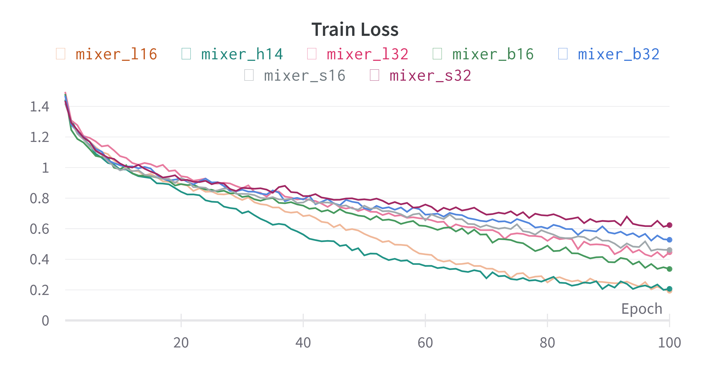
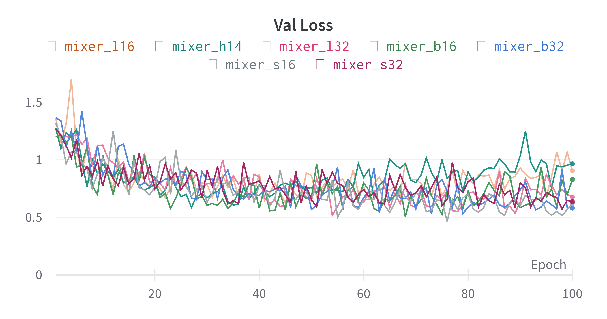
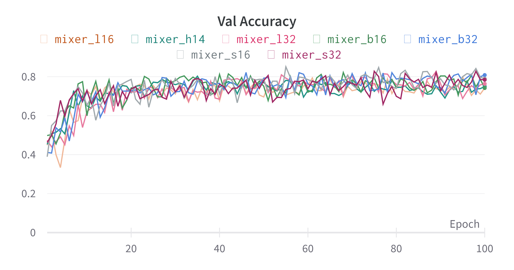

# MLP Mixer (Pytorch): Classify flowers with Flowers dataset and Compare models

**Link paper**: [MLP-Mixer: An all-MLP Architecture for Vision](https://arxiv.org/abs/2105.01601)

## Overview


## Usage
1. Training model
```bash
!python train.py --train-folder /content/Flower_dataset/train\
                 --valid-folder /content/Flower_dataset/valid\
                 --model-folder /content/drive/MyDrive/MLP-Mixer/weights\
                 --model mixer_b16\
                 --num-classes 5\
                 --image-size 256\
                 --epochs 100\
                 --batch-size 64\
                 --lr 0.0001\
                 --logger wandb\
                 --save-interval 20\
                 --id-name xxx\ # id name of experiment on wandb
                 --resume /path/to/model.pt # (resume training)
```
2. Predict
```bash
!python predict.py --source /content/5135131051_102d4878ca_n.jpg 
                   --image-size 256\
                   --model weights/mixer_s32.pt\
                   --device 'cuda'
```

## Models
**Some models are available: mixer_s32, mixer_s16, mixer_b32, mixer_b16, mixer_l32, mixer_l16, mixer_h14**

**You can training with your custom model by set some `important` arguments:**

```bash
      --num-classes: The number of your problem classes
      --num-mlp-blocks: The number of MLP Blocks
      --patch-size: Patch image
      --hidden-dim: Projection units
      --tokens-mlp-dim: Token-mixing units
      --channels-mlp-dim: Channel-mixing units
      --image-size: Size of image
```

## Results






## Reference
https://github.com/d-li14/mlp-mixer.pytorch
https://towardsdatascience.com/mlp-mixer-is-all-you-need-20dbc7587fe4


